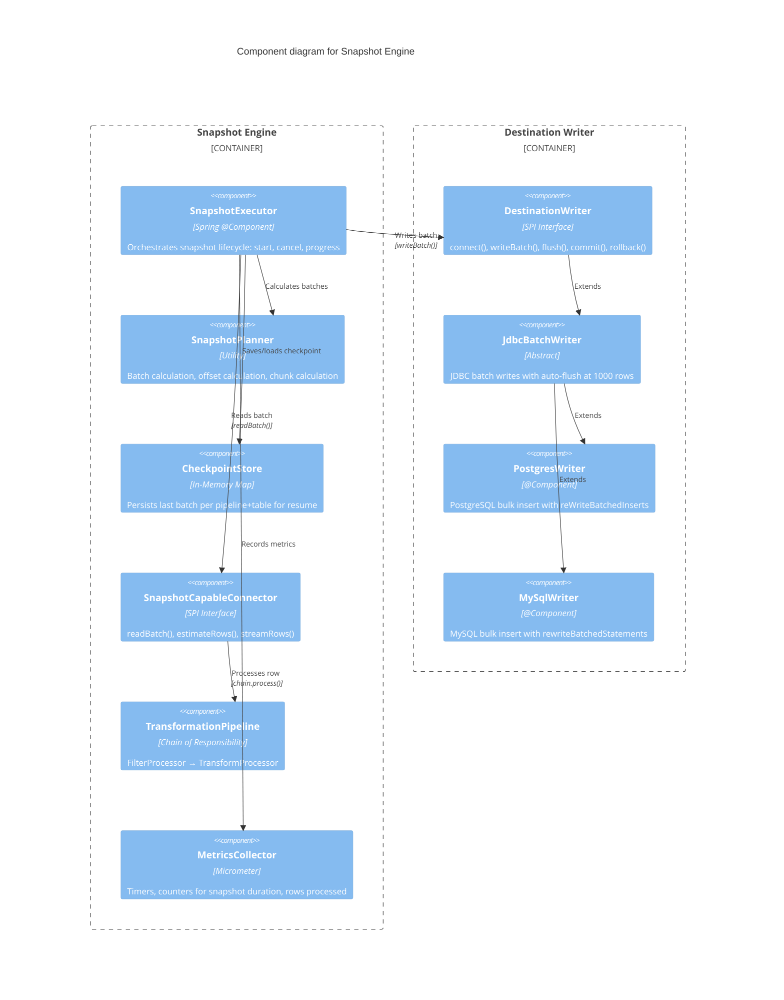

# C4 Level 3: Components — Snapshot Engine

```mermaid
C4Component
    title Component diagram for Snapshot Engine

    Container_Boundary(snapshot_engine, "Snapshot Engine") {
        Component(snap_exec, "SnapshotExecutor", "Spring @Component", "Orchestrates snapshot lifecycle: start, cancel, progress")
        Component(planner, "SnapshotPlanner", "Utility", "Batch calculation, offset calculation, chunk calculation")
        Component(checkpoint, "CheckpointStore", "In-Memory Map", "Persists last batch per pipeline+table for resume")
        Component(snap_spi, "SnapshotCapableConnector", "SPI Interface", "readBatch(), estimateRows(), streamRows()")
        Component(transform, "TransformationPipeline", "Chain of Responsibility", "FilterProcessor → TransformProcessor")
        Component(metrics, "MetricsCollector", "Micrometer", "Timers, counters for snapshot duration, rows processed")
    }

    Container_Boundary(writer, "Destination Writer") {
        Component(writer_spi, "DestinationWriter", "SPI Interface", "connect(), writeBatch(), flush(), commit(), rollback()")
        Component(jdbc_writer, "JdbcBatchWriter", "Abstract", "JDBC batch writes with auto-flush at 1000 rows")
        Component(pg_writer, "PostgresWriter", "@Component", "PostgreSQL bulk insert with reWriteBatchedInserts")
        Component(mysql_writer, "MySqlWriter", "@Component", "MySQL bulk insert with rewriteBatchedStatements")
    }

    Rel(snap_exec, planner, "Calculates batches")
    Rel(snap_exec, checkpoint, "Saves/loads checkpoint")
    Rel(snap_exec, snap_spi, "Reads batch", "readBatch()")
    Rel(snap_spi, transform, "Processes row", "chain.process()")
    Rel(snap_exec, writer_spi, "Writes batch", "writeBatch()")
    Rel(writer_spi, jdbc_writer, "Extends")
    Rel(jdbc_writer, pg_writer, "Extends")
    Rel(jdbc_writer, mysql_writer, "Extends")
    Rel(snap_exec, metrics, "Records metrics")

    UpdateLayoutConfig($c4ShapeInRow="3", $c4BoundaryInRow="2")
```
