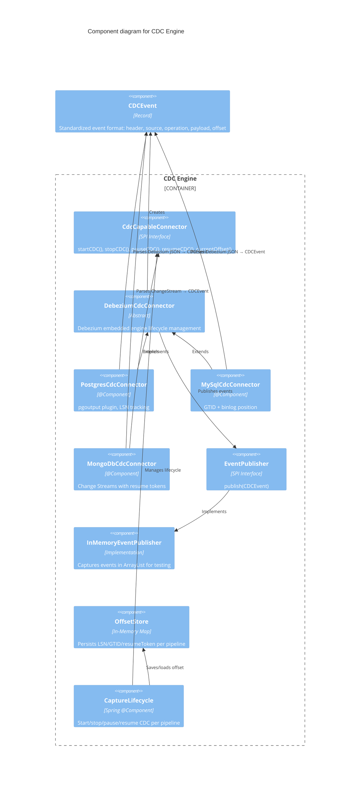

# C4 Level 3: Components — CDC Engine

```mermaid
C4Component
    title Component diagram for CDC Engine

    Container_Boundary(cdc_engine, "CDC Engine") {
        Component(cdc_spi, "CdcCapableConnector", "SPI Interface", "startCDC(), stopCDC(), pauseCDC(), resumeCDC(), currentOffset()")
        Component(debezium_conn, "DebeziumCdcConnector", "Abstract", "Debezium embedded engine lifecycle management")
        Component(pg_cdc, "PostgresCdcConnector", "@Component", "pgoutput plugin, LSN tracking")
        Component(mysql_cdc, "MySqlCdcConnector", "@Component", "GTID + binlog position")
        Component(mongo_cdc, "MongoDbCdcConnector", "@Component", "Change Streams with resume tokens")
        Component(publisher, "EventPublisher", "SPI Interface", "publish(CDCEvent)")
        Component(in_mem_pub, "InMemoryEventPublisher", "Implementation", "Captures events in ArrayList for testing")
        Component(offset_store, "OffsetStore", "In-Memory Map", "Persists LSN/GTID/resumeToken per pipeline")
        Component(capture_lifecycle, "CaptureLifecycle", "Spring @Component", "Start/stop/pause/resume CDC per pipeline")
    }

    Component(domain, "CDCEvent", "Record", "Standardized event format: header, source, operation, payload, offset")

    Rel(pg_cdc, debezium_conn, "Extends")
    Rel(mysql_cdc, debezium_conn, "Extends")
    Rel(mongo_cdc, cdc_spi, "Implements")
    Rel(debezium_conn, publisher, "Publishes events")
    Rel(publisher, in_mem_pub, "Implements")
    Rel(capture_lifecycle, cdc_spi, "Manages lifecycle")
    Rel(capture_lifecycle, offset_store, "Saves/loads offset")
    Rel(debezium_conn, domain, "Creates")
    Rel(pg_cdc, domain, "Parses Debezium JSON → CDCEvent")
    Rel(mysql_cdc, domain, "Parses Debezium JSON → CDCEvent")
    Rel(mongo_cdc, domain, "Parses ChangeStream → CDCEvent")

    UpdateLayoutConfig($c4ShapeInRow="3", $c4BoundaryInRow="2")
```
