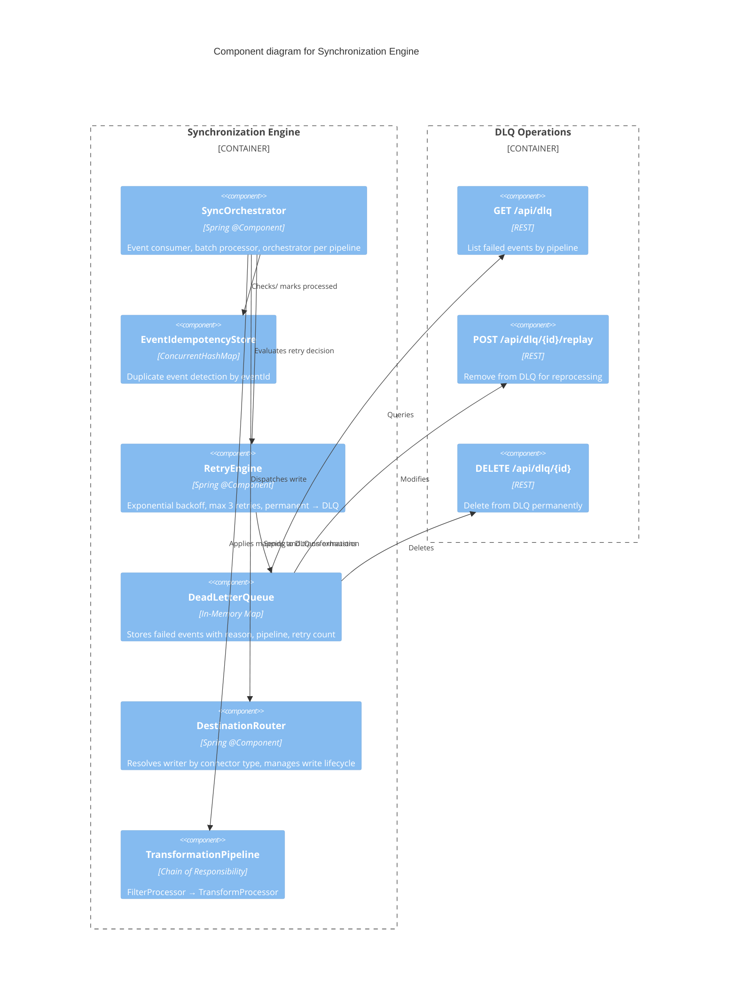

# C4 Level 3: Components — Synchronization Engine

```mermaid
C4Component
    title Component diagram for Synchronization Engine

    Container_Boundary(sync_engine, "Synchronization Engine") {
        Component(orchestrator, "SyncOrchestrator", "Spring @Component", "Event consumer, batch processor, orchestrator per pipeline")
        Component(idempotency, "EventIdempotencyStore", "ConcurrentHashMap", "Duplicate event detection by eventId")
        Component(retry, "RetryEngine", "Spring @Component", "Exponential backoff, max 3 retries, permanent → DLQ")
        Component(dlq, "DeadLetterQueue", "In-Memory Map", "Stores failed events with reason, pipeline, retry count")
        Component(router, "DestinationRouter", "Spring @Component", "Resolves writer by connector type, manages write lifecycle")
        Component(transform, "TransformationPipeline", "Chain of Responsibility", "FilterProcessor → TransformProcessor")
    }

    Container_Boundary(dlq_ops, "DLQ Operations") {
        Component(dlq_list, "GET /api/dlq", "REST", "List failed events by pipeline")
        Component(dlq_replay, "POST /api/dlq/{id}/replay", "REST", "Remove from DLQ for reprocessing")
        Component(dlq_delete, "DELETE /api/dlq/{id}", "REST", "Delete from DLQ permanently")
    }

    Rel(orchestrator, idempotency, "Checks/ marks processed")
    Rel(orchestrator, retry, "Evaluates retry decision")
    Rel(retry, dlq, "Sends to DLQ on exhaustion")
    Rel(orchestrator, router, "Dispatches write")
    Rel(orchestrator, transform, "Applies mapping and transformations")
    Rel(dlq, dlq_list, "Queries")
    Rel(dlq, dlq_replay, "Modifies")
    Rel(dlq, dlq_delete, "Deletes")
```
