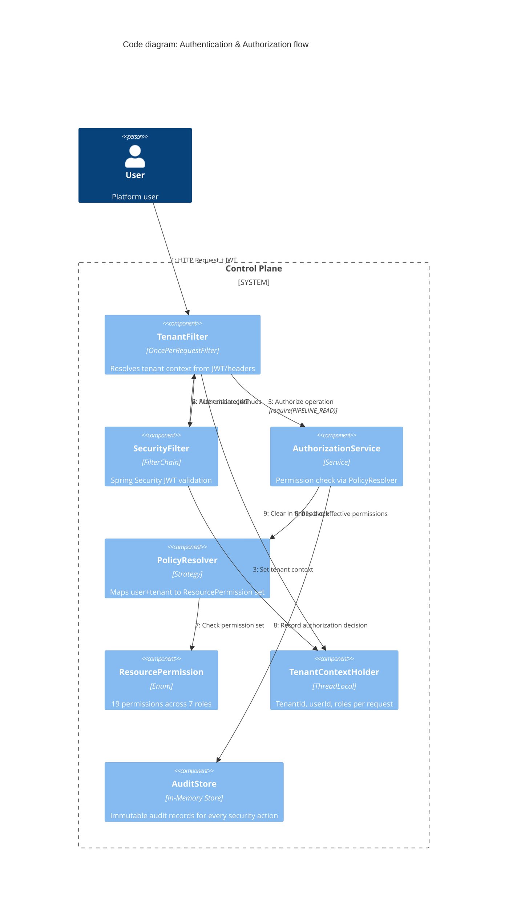

# C4 Level 4: Code — Security Module

```mermaid
C4Dynamic
    title Code diagram: Authentication & Authorization flow

    Person(user, "User", "Platform user")

    System_Boundary(syncflow, "Control Plane") {
        Component(front_door, "TenantFilter", "OncePerRequestFilter", "Resolves tenant context from JWT/headers")
        Component(auth_filter, "SecurityFilter", "FilterChain", "Spring Security JWT validation")
        Component(authz, "AuthorizationService", "Service", "Permission check via PolicyResolver")
        Component(policy, "PolicyResolver", "Strategy", "Maps user+tenant to ResourcePermission set")
        Component(permissions, "ResourcePermission", "Enum", "19 permissions across 7 roles")
        Component(tenant_holder, "TenantContextHolder", "ThreadLocal", "TenantId, userId, roles per request")
        Component(audit, "AuditStore", "In-Memory Store", "Immutable audit records for every security action")
    }

    Rel(user, front_door, "HTTP Request + JWT")
    Rel(front_door, auth_filter, "Authenticate JWT")
    Rel(auth_filter, tenant_holder, "Set tenant context")
    Rel(auth_filter, front_door, "Filter chain continues")
    Rel(front_door, authz, "Authorize operation", "require(PIPELINE_READ)")
    Rel(authz, policy, "Resolve effective permissions")
    Rel(policy, permissions, "Check permission set")
    Rel(authz, audit, "Record authorization decision")
    Rel(front_door, tenant_holder, "Clear in finally block")
```
